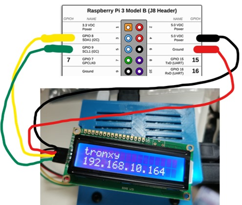
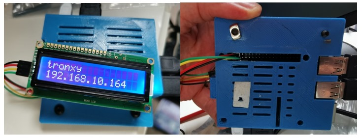
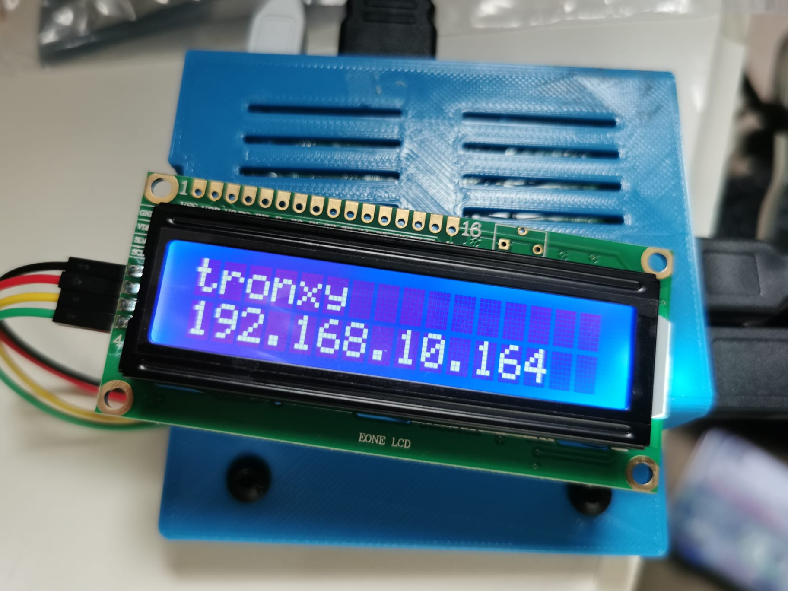

# OctoDisplay

OLED/LCD display for OctoPi 3D Printers

Removes the need for a display or looking for attached devices on your network when trying to connect to your printer

Connects to the i2c interface on the Raspberry Pi header

# Wiring the Display

Tutorial https://lastminuteengineers.com/i2c-lcd-arduino-tutorial/ 

# Installation

sudo raspi-config to enable i2c interface

sudo pip install RPLCD 

sudo apt-get install i2c-tools 

sudo apt install python3-smbus 

# Operation

